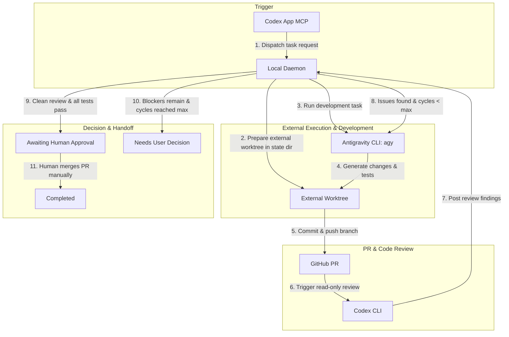

# codex-anti-orchestrator

> **Local Orchestrator for Codex Review, Antigravity Development, and GitHub PR Handoff.**

`codex-anti-orchestrator` is a lightweight, local-first orchestration daemon designed to bridge **Codex App (MCP)**, **Antigravity CLI (`agy`)**, **GitHub Pull Requests**, and **OpenAI Codex CLI (`codex`)** into a structured, secure, and human-supervised automated development loop.

---

## 1. Target Architecture & Workflow

The orchestration loop follows a closed-loop pipeline where development, review, and fix iterations happen autonomously within isolated worktrees located outside the target repository, while merge and deployment decisions remain strictly under human control.



---

## 2. Component Responsibilities

| Component                   | Responsibility                                                                                                                 | Constraints & Permissions                                                                                                      |
| :-------------------------- | :----------------------------------------------------------------------------------------------------------------------------- | :----------------------------------------------------------------------------------------------------------------------------- |
| **Codex App MCP**           | User-facing entrypoint for receiving development instructions and task dispatch.                                               | Dispatches task descriptors to the local daemon; does not execute file changes directly.                                       |
| **Local Daemon**            | Manages the state machine, enforces security boundaries, allocates isolated external worktrees, and controls iteration counts. | Strictly local process; does not install root/launchd services without explicit user intervention.                             |
| **Antigravity CLI (`agy`)** | Executes coding tasks, test generation, and fixes inside the assigned external worktree.                                       | Restricted to the isolated worktree directory; forbidden from using dangerous bypass flags (`--dangerously-skip-permissions`). |
| **GitHub PR**               | Central collaboration artifact, audit trail, and security boundary for changes.                                                | Minimal token scopes (`repo`, `workflow`); no automatic merge.                                                                 |
| **Codex CLI (`codex`)**     | Performs automated, read-only static and semantic code reviews on generated diffs.                                             | Strictly read-only; cannot modify source files, push commits, or merge PRs.                                                    |

---

## 3. Non-Goals

- **No Automatic Merging or Deployment**: Merging to `main` and production deployments require explicit human review and authorization.
- **No Direct Mutation on Primary Worktree**: Tasks run in isolated Git worktrees located outside the target repository (e.g. `~/.codex-anti-orchestrator/worktrees/`).
- **No Unsafe Permission Bypassing**: Tools like `agy` must run under standard permission and sandbox boundaries.
- **No Cloud SaaS Dependency**: Orchestration logic runs 100% locally on the developer's machine.
- **No Credential Storage in Repository**: Tokens and machine secrets must never be committed to git, written to logs, or embedded in code.

---

## 4. Prerequisites

Before running the orchestrator, ensure the following tools are installed and properly configured on your machine:

1. **Node.js**: `v20.0.0` or higher (v24+ recommended).
2. **Git**: `2.30.0` or higher with configured GitHub remote `origin`.
3. **GitHub CLI (`gh`)**: Installed and authenticated:
   ```bash
   gh auth status
   ```
4. **Antigravity CLI (`agy`)**: Installed and available in `$PATH`:
   ```bash
   agy --version
   ```
5. **OpenAI Codex CLI (`codex`)**: Installed and available in `$PATH`:
   ```bash
   codex --version
   ```

---

## 5. Quick Start & Commands

### Diagnostic Health Check (`doctor`)

The `doctor` command verifies all system prerequisites and repository state without modifying any files or credentials:

```bash
# Run human-readable diagnostics
npm run doctor

# Run clean JSON diagnostics for scripting
npm run doctor -- --json
```

### Development & Testing

```bash
# Install dependencies
npm install

# Type checking
npm run typecheck

# Run test suite (unit + real CLI integration tests)
npm test

# Format checking
npm run format:check

# Format code
npm run format

# Build TypeScript to dist/
npm run build
```

---

## 6. Documentation Index

- [Security Model & Constraints](docs/security.md): Detailed external worktree isolation, token safety, read-only constraints, and permission boundaries.
- [State Machine & Failure Handling](docs/state-machine.md): Task state definitions, `NEEDS_USER_DECISION` vs `AWAITING_HUMAN_APPROVAL`, retry backoff, and stop conditions.
