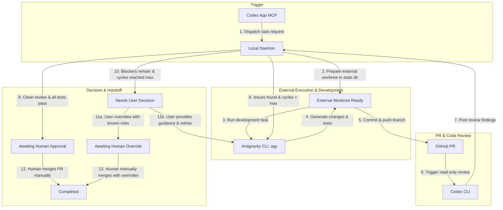

# codex-anti-orchestrator

> **Local Orchestrator for Codex Review, Antigravity Development, and GitHub PR Handoff.**

`codex-anti-orchestrator` is a lightweight, local-first orchestration daemon designed to bridge **Codex App (MCP)**, **Antigravity CLI (`agy`)**, **GitHub Pull Requests**, and **OpenAI Codex CLI (`codex`)** into a structured, secure, and human-supervised automated development loop.

---

## 1. Target Architecture & Workflow

The orchestration loop follows a closed-loop pipeline where development, review, and fix iterations happen autonomously within isolated worktrees located outside the target repository, while merge and deployment decisions remain strictly under human control.



---

## 2. Component Responsibilities

| Component                   | Responsibility                                                                                                                 | Constraints & Permissions                                                                                                      |
| :-------------------------- | :----------------------------------------------------------------------------------------------------------------------------- | :----------------------------------------------------------------------------------------------------------------------------- |
| **Codex App MCP**           | User-facing entrypoint for receiving development instructions and task dispatch.                                               | Dispatches task descriptors to the local daemon; does not execute file changes directly.                                       |
| **Local Daemon**            | Manages the state machine, enforces security boundaries, allocates isolated external worktrees, and controls iteration counts. | Strictly local process; does not install root/launchd services without explicit user intervention.                             |
| **Antigravity CLI (`agy`)** | Executes coding tasks, test generation, and fixes inside the assigned external worktree.                                       | Restricted to the isolated worktree directory; forbidden from using dangerous bypass flags (`--dangerously-skip-permissions`). |
| **GitHub PR**               | Central collaboration artifact, audit trail, and security boundary for changes.                                                | Minimal token scopes (`repo`, `workflow`); no automatic merge.                                                                 |
| **Codex CLI (`codex`)**     | Performs automated, read-only static and semantic code reviews on generated diffs.                                             | Strictly read-only; cannot modify source files, push commits, or merge PRs.                                                    |

---

## 3. Non-Goals

- **No Automatic Merging or Deployment**: Merging to `main` and production deployments require explicit human review and authorization.
- **No Direct Mutation on Primary Worktree**: Tasks run in isolated Git worktrees located outside the target repository (e.g. `~/.codex-anti-orchestrator/worktrees/`).
- **No Unsafe Permission Bypassing**: Tools like `agy` must run under standard permission and sandbox boundaries.
- **No Cloud SaaS Dependency**: Orchestration logic runs 100% locally on the developer's machine.
- **No Credential Storage in Repository**: Tokens and machine secrets must never be committed to git, written to logs, or embedded in code.

---

## 4. Prerequisites

Before running the orchestrator, ensure the following tools are installed and properly configured on your machine:

1. **Node.js**: `v20.0.0` or higher (v24+ recommended).
2. **Git**: `2.30.0` or higher with configured GitHub remote `origin`.
3. **GitHub CLI (`gh`)**: Installed and authenticated:
   ```bash
   gh auth status
   ```
4. **Antigravity CLI (`agy`)**: Installed and available in `$PATH`:
   ```bash
   agy --version
   ```
5. **OpenAI Codex CLI (`codex`)**: Installed and available in `$PATH`:
   ```bash
   codex --version
   ```

---

## 5. Quick Start & Commands

### Diagnostic Health Check (`doctor`)

The `doctor` command verifies all system prerequisites and repository state without modifying any files or credentials:

```bash
# Run human-readable diagnostics
npm run doctor

# Run clean JSON diagnostics for scripting
npm run doctor -- --json
```

### Orchestrator CLI Commands

```bash
# 1. Initialize a new development task and allocate external worktree
npx tsx src/cli.ts create --repo /Users/lisong/code/my-project --prompt "Implement user auth"

# 2. Run the automated development, PR, and review state loop
npx tsx src/cli.ts run <taskId>

# 3. Check status of a specific task or list all tasks
npx tsx src/cli.ts status <taskId>
npx tsx src/cli.ts status --all

# 4. Resume a task with human override or additional guidance
npx tsx src/cli.ts resume <taskId> --override
npx tsx src/cli.ts resume <taskId> --guidance "Fix null pointer in session handler"

# 5. Cancel an active task while preserving its worktree
npx tsx src/cli.ts cancel <taskId> --reason "User requested stop"
```

### Development & Testing

```bash
# Type checking
npm run typecheck

# Run test suite (unit + integration + adapter tests)
npm test

# Format checking
npm run format:check

# Format code
npm run format

# Build TypeScript to dist/
npm run build
```

### Codex Desktop MCP Configuration (stdio)

The orchestrator provides a Model Context Protocol (MCP) server running over standard I/O (`stdio`), allowing Codex Desktop to dispatch and manage orchestrated tasks safely.

#### 1. Build Prerequisite

Before running the MCP server, compile the TypeScript source to `dist/`:

```bash
npm run build
```

#### 2. Exact Configuration Pattern

Add `codex-anti-orchestrator` to your Codex Desktop MCP configuration (e.g. `~/.codex/config.json` or application MCP settings) using the absolute path to `bin/mcp.js`:

```json
{
  "mcpServers": {
    "codex-anti-orchestrator": {
      "command": "node",
      "args": ["/Users/lisong/code/tools/codex-anti-orchestrator/bin/mcp.js"]
    }
  }
}
```

_(Note: Replace `/Users/lisong/code/tools/codex-anti-orchestrator` with the absolute path to your local repository directory)._

#### 3. Available MCP Tools

The MCP server exposes strictly the following six authorized orchestration tools:

1. `orchestrator_create_task`: Validates target repository cleanliness and lockfile safety, and allocates an isolated external Git worktree for the task.
2. `orchestrator_run_task`: Executes the automated development, GitHub PR creation, and Codex review state loop for a task.
3. `orchestrator_get_task_status`: Retrieves current lifecycle state, transition history, and diagnostics for a specific task.
4. `orchestrator_list_tasks`: Lists all development tasks tracked in the orchestrator state directory.
5. `orchestrator_resume_task`: Resumes a task from `NEEDS_USER_DECISION` or `FAILED` state, supporting user guidance instructions (risk-acceptance override is strictly human-only via CLI).
6. `orchestrator_cancel_task`: Cancels an active or pending task (`ABORTED`) while safely preserving the external worktree for inspection.

#### 4. Safety & Tool Boundary Guarantees

- **Stable JSON Text Responses**: Every MCP tool response returns stable JSON text (`{ "ok": true, "data": ... }` on success, `{ "ok": false, "error": { "code": "...", "message": "..." } }` on error) with secret redaction and bounded safe error messages without raw stack traces.
- **No Risk-Acceptance Override over MCP**: The `override` parameter is strictly omitted from the MCP surface. Transitioning to `AWAITING_HUMAN_OVERRIDE` requires explicit human CLI execution (`npx tsx src/cli.ts resume <taskId> --override`).
- **No Merge Tools**: Merge and auto-merge tools (`gh pr merge`, auto-approval, fast-forwarding) do not exist. Merging PRs remains strictly a human-supervised action.
- **No Deployment Tools**: Deployment, release creation, publishing, and workflow dispatch tools do not exist.
- **No Arbitrary Shell Execution Tools**: Arbitrary bash, command execution, or terminal evaluation tools do not exist. External tools operate strictly within their constrained adapters.

---

## 6. Phase 3 Safety & Control Guarantees

1. **Safe Child Process Abstraction**:
   - Strictly uses argument arrays only (`execFile` with `shell: false`).
   - Configurable timeouts and bounded stdout/stderr buffers (prevent memory leaks / hangs).
   - Exit code, signal tracking, and automated secret redaction (GitHub tokens, OpenAI/Anthropic keys, Bearer headers, password-embedded URLs).
   - Pre-execution rejection of forbidden flags (`--dangerously-skip-permissions`).
2. **Antigravity CLI (`agy`) Adapter**:
   - Validates external worktree location outside target repository.
   - Invokes `agy` with `--sandbox` and structured development/fix prompts.
   - Fully stateless per invocation (no false promise of internal daemon resume).
3. **OpenAI Codex CLI (`codex`) Adapter**:
   - Operates in strictly read-only sandbox mode (`codex exec --sandbox read-only`).
   - Validates structured verdicts: `APPROVE`, `CHANGES_REQUIRED`, `NEEDS_USER_DECISION`.
   - Fail-safe fallback: malformed, unparseable, or absent output automatically defaults to `NEEDS_USER_DECISION`.
4. **GitHub PR Adapter (`gh`)**:
   - Manages PR metadata only (`create`, `view`, `update`, `checks`).
   - Hard block on auto-merge (`gh pr merge`), workflow dispatch, release creation, and deployments.
   - Strictly blocks direct pushes to `main` and protected branches; enforces `anti/*` task branches.
5. **Controlled State Loop**:
   - Enforces legal state machine transitions and bounded iteration cycles (`MAX_REVIEW_CYCLES = 3`).
   - `AWAITING_HUMAN_APPROVAL` is strictly guarded: requires both automated tests green AND Codex review `APPROVE`.
   - Preserves diagnostics and isolated worktrees on decision, override, or failure.

---

## 7. Documentation Index

- [Security Model & Constraints](docs/security.md): Detailed external worktree isolation, secret scrubbing, process safety, and permission boundaries.
- [State Machine & Failure Handling](docs/state-machine.md): Task state definitions, `NEEDS_USER_DECISION` vs `AWAITING_HUMAN_APPROVAL` vs `AWAITING_HUMAN_OVERRIDE`, iteration limits, and stop conditions.
