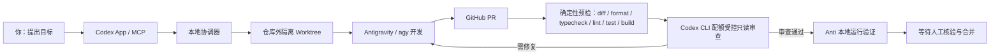

# codex-anti-orchestrator

> **一个本地优先的 AI 协作编排器：Codex 负责审查，Antigravity 负责开发，GitHub PR 负责交接，最终由人决定是否合并。**

[English](README.md)

`codex-anti-orchestrator` 将 Codex App（MCP）、Antigravity CLI（`agy`）、GitHub Pull Request 和 OpenAI Codex CLI（`codex`）串成一个可审计的开发闭环。它适合这样的工作方式：你只提出目标，Anti 在隔离工作区中实现和修复，Codex 只读审查每轮变更；任何合并和部署始终由人明确决定。

## 它如何工作



## 组件职责与边界

| 组件 | 职责 | 约束与权限 |
| :-- | :-- | :-- |
| **Codex App MCP** | 接收你的开发目标，创建、运行、查询和恢复协作任务。 | 只发送结构化任务请求，不直接修改项目文件。首次使用必须先获得你对允许目录的明确确认。 |
| **本地协调器** | 管理状态机、隔离 worktree、修复轮数和安全校验。 | 仅在本机运行；不安装 root/launchd 服务；不持久化凭据。 |
| **Antigravity CLI (`agy`)** | 在隔离 worktree 中实现功能、补充测试和修复审查问题。 | 使用受限的非交互调用；禁止 `--dangerously-skip-permissions` 等绕过权限的参数。 |
| **GitHub Pull Request** | 提供变更交接、CI 状态和人工审查记录。 | 仅用于 PR 元数据、分支推送和 CI 查询；不允许自动合并。 |
| **Codex CLI (`codex`)** | 对 PR 差异进行自动化静态和语义审查。 | 始终处于只读沙箱；不能改文件、提交、推送或合并。 |

核心原则：

- Anti 只在目标仓库外的隔离 Git worktree 中工作，不直接修改你的主工作区。
- 每次真实调用前，协调器会创建或刷新一个确定性的 Agy 项目配置，并通过 `--project` 显式选中。权限仅覆盖当前任务 worktree 的文件读写及少量检查、构建、测试命令；不会扩大 Agy 全局权限。
- Codex CLI 只在确定性预检全绿后进入模型审查；真实 Codex 调用有持久化硬上限和 SHA 缓存，不提交代码、不推送、更不会合并 PR。
- 自动化流程可以创建、更新 PR 并迭代修复；**不会自动合并、部署、发布或绕过分支保护**。
- 监控页仅监听 `127.0.0.1`，只读展示任务、审查、CI 和本地验证状态。

## 明确不做的事

- **不自动合并或部署**：合并到 `main` 和生产部署必须由人明确批准。
- **不修改主工作区**：协调器在目标仓库外建立 Git worktree，主工作区保持不受任务修改影响。
- **不绕过权限与沙箱**：不会使用危险的权限跳过参数。
- **不依赖云端协调服务**：协调逻辑在你的机器上运行；GitHub 仅承担 PR 和 CI 协作。
- **不把凭据写入仓库**：Token、API Key 和本机配置不得提交、记录或嵌入代码。

## 前置条件

在每台运行协调器的机器上安装并登录：

1. Node.js 20 或更高版本（推荐 Node.js 24+）
2. Git 2.30+，目标仓库有 GitHub `origin` 远程地址
3. [GitHub CLI](https://cli.github.com/)：`gh auth status`
4. Antigravity CLI：`agy --version`
5. OpenAI Codex CLI：`codex --version`

克隆并安装依赖：

```bash
# 在 GitHub 仓库页面通过 Code → HTTPS 复制实际克隆地址
git clone <repository-url>
cd codex-anti-orchestrator
npm install
npm run build
```

可先运行只读诊断，确认依赖、登录状态和目标仓库条件：

```bash
npm run doctor
# 脚本使用时可取得纯 JSON 输出
npm run doctor -- --json
```

## 首次使用：确认允许目录

“允许目录”是协调器可以作为**目标项目**访问的本地目录树，例如 `/Users/alice/code` 或 `/Users/alice/projects`。它是一道安全边界：只有该目录下的仓库可以创建任务；越界路径和通过符号链接逃逸的路径都会被拒绝。这样可避免任务路径出错或 AI 操作失控时触及其他仓库、个人文件或系统目录。

每台机器初始都没有默认允许目录。首次使用前，选择一个尽量窄、只包含待协作项目的父目录，然后明确确认：

```bash
npx tsx src/cli.ts configure --allowed-base /absolute/path/to/projects --confirm
```

配置会以 canonical path 和确认时间保存在本机：

```text
~/.codex-anti-orchestrator/allowed-base.json
```

如设置了 `CODEX_ORCHESTRATOR_STATE_DIR`，则保存到该状态目录。文件系统根目录 `/` 和整个 home 目录不能作为允许目录。换一台机器时需要重新确认；想更换允许目录时，再运行一次上述命令即可。

通过 MCP 第一次创建任务而尚未配置时，协调器会停止操作并返回建议的项目父目录。Codex 应先将该目录展示给你并询问确认；只有你明确同意，才会调用 `orchestrator_configure_allowed_base` 保存配置。

## 命令行使用

```bash
# 创建任务：会先验证仓库干净度、Git 锁文件和允许目录，并在仓库外创建 worktree
npx tsx src/cli.ts create \
  --repo /absolute/path/to/projects/my-project \
  --prompt "实现用户登录功能，并添加测试"

# 运行 Anti 开发、PR 创建、Codex 审查和自动修复循环
npx tsx src/cli.ts run <taskId>

# 查看单个任务，或列出全部任务
npx tsx src/cli.ts status <taskId>
npx tsx src/cli.ts status --all

# 提供额外修复指引后恢复任务
npx tsx src/cli.ts resume <taskId> --guidance "修复会话处理中的空指针"

# 以已知风险人工放行（不会变成 clean approval，也不会自动合并）
npx tsx src/cli.ts resume <taskId> --override

# 停止任务；隔离 worktree 会保留，便于检查
npx tsx src/cli.ts cancel <taskId> --reason "停止此任务"
```

## 本机监控页

运行以下命令可启动只读监控页：

```bash
npx tsx src/cli.ts monitor
# 或指定端口
npx tsx src/cli.ts monitor --port 4390
```

页面只监听 `http://127.0.0.1:<port>`，每三秒刷新，展示任务状态流转、PR 链接、测试与 CI 观察结果、Codex 人工核验清单、Anti 的 localhost 验证证据，以及经过脱敏的事件流。

开发调用同样采用 Fail-Closed 策略。如果 Antigravity 在工具边界成功退出、但隔离 worktree 尚无变更，编排器最多发送两次无状态续跑提示（合计三次调用），并把上一轮的有界输出保留在任务事件流中。任一命令报错仍会立即停止；耗尽次数后不会提交或创建 PR。从失败状态恢复时提供的 guidance 会先追加到持久化任务提示词，再进入重试。

每次 Codex 真正调用模型前，适配器都会先执行 `git diff --check`，以及项目实际存在的 `format:check`、`typecheck`、`lint`、`test`、`build` 等白名单脚本。任何确定性检查失败都会直接交回 Anti 修复，不占用 Codex 调用额度。每个任务 worktree 的真实 Codex 调用持久化硬上限为 3 次；同一不可变审查身份会命中缓存，同一个 HEAD 不会重复审查。只有“上一轮 Codex 已 `APPROVE` 且该 HEAD 仍是新 HEAD 祖先”时，后续才允许只审修复增量；若上一轮是 `CHANGES_REQUIRED`，下一轮仍做全量复审，避免旧 blocker 因文件未再次修改而消失。预检已经通过的默认 `test` 结果会被状态机复用，避免紧接着重复跑同一套测试；自定义 test runner 和没有标准 `test` script 的项目仍保持原有回退行为。

任意 MCP 工具首次被调用时，也会自动启动同一只读监控页并在本机浏览器打开。默认优先使用 `http://127.0.0.1:4390`；端口被占用时会安全地选择下一个可用本机端口。

## 配置 Codex Desktop MCP

先构建项目：

```bash
npm run build
```

在 Codex Desktop 的 `~/.codex/config.toml` 添加：

```toml
[mcp_servers.codex-anti-orchestrator]
command = "node"
args = ["/absolute/path/to/codex-anti-orchestrator/bin/mcp.js"]
cwd = "/absolute/path/to/codex-anti-orchestrator"
```

将两处 `/absolute/path/to/codex-anti-orchestrator` 替换为本机的真实仓库绝对路径，并重启 Codex Desktop。

MCP 暴露的工具只有：

1. `orchestrator_configure_allowed_base`：在你明确确认后保存允许目录。
2. `orchestrator_create_task`：创建隔离任务并做安全预检。
3. `orchestrator_run_task`：执行开发、PR 和审查循环。
4. `orchestrator_get_task_status`：读取任务状态和诊断。
5. `orchestrator_list_tasks`：列出本机已记录任务。
6. `orchestrator_resume_task`：从需人工决策或失败状态恢复，并附加修复指引。
7. `orchestrator_cancel_task`：中止任务并保留 worktree。

MCP 不提供风险放行、任意命令执行、合并、自动合并、部署、发布或工作流触发工具。

## 运行时安全与控制

1. **安全的子进程调用**：所有 `git`、`gh`、`agy` 与 `codex` 命令均使用参数数组调用，不拼接 shell 命令；执行有超时和输出大小限制，日志会脱敏 GitHub Token、OpenAI/Anthropic Key、Bearer Token 和 URL 密码。
2. **Anti 开发适配器**：只接受已校验的模型和超时参数，在外部 worktree 中以 `--sandbox`、`--mode accept-edits`、`--print` 运行；每一轮调用都是带完整上下文的无状态执行。
3. **Codex 审查适配器**：先执行不消耗模型额度的确定性预检，再使用原生 `codex exec review --base <不可变基线>`；忽略用户配置、使用临时会话，并关闭与代码审查无关的插件、应用、记忆、浏览器、电脑操作、图片生成和 hooks。真实模型调用每任务最多 3 次，干净解析结果按不可变审查身份持久化缓存；预算或缓存状态异常会 Fail-Closed。审查结论只能是 `APPROVE`、`CHANGES_REQUIRED` 或 `NEEDS_USER_DECISION`。
4. **GitHub PR 适配器**：仅允许创建、查看、更新 PR 和查询检查状态；禁止 merge、workflow dispatch、release、deploy、publish 等操作，也禁止直接推送到受保护分支。
5. **受控状态循环**：修复轮数默认最多 3 轮，并与“每任务最多 3 次真实 Codex 模型调用”的硬预算独立计数。确定性预检结果会进入 diagnostics；已经通过的默认测试证据可直接复用，避免同一 HEAD 紧接着重复测试。每次状态流转、审查摘要和错误诊断都会保留；失败、人工决策和人工核验阶段的 worktree 会保留以供检查。
6. **有界 CI 等待与本机可观测性**：CI pending 会在有限次数内轮询，不会无限等待。监控页只读、仅 localhost 访问，事件内容经过长度限制和凭据脱敏。

## 安全与人工验收

任务完成不等于 PR 已获准合并。只有以下条件都满足，任务才会进入 `AWAITING_HUMAN_APPROVAL`：

1. 本地自动化测试通过。
2. GitHub PR CI 全部通过。
3. Codex 的只读审查结论为 `APPROVE`，且没有阻断项。
4. Anti 已启动当前项目的本地开发环境，按 Codex 提供的核验清单完成验证，并留下结构化证据。

此时系统停止自动化操作，保留 worktree，由你在 GitHub 和本机运行态中最终核验并手动合并。若仍有风险或修复轮数耗尽，任务进入 `NEEDS_USER_DECISION`；即使你以 `--override` 继续，也只会进入 `AWAITING_HUMAN_OVERRIDE`，永远不会被自动视为干净可合并。

## 开发与验证

```bash
npm run typecheck
npm test
npm run format:check
npm run build
```

更多细节：

- [安全模型与约束](docs/security.md)
- [状态机与失败处理](docs/state-machine.md)
