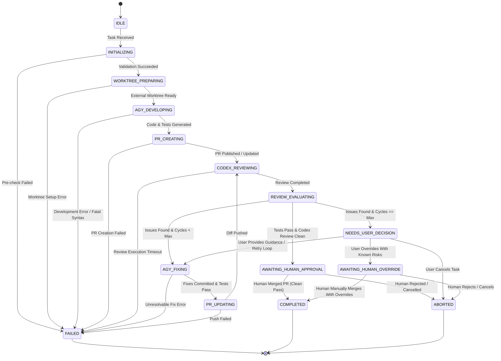

# Orchestrator State Machine & Failure Handling

This document defines the lifecycle states, transition rules, retry strategies, and termination conditions governing task execution in `codex-anti-orchestrator`.

---

## 1. State Machine Overview

The orchestrator operates as a deterministic finite-state machine (FSM). Each task progresses through a structured sequence of development, review, and fix cycles before transitioning to human review.

---

## 2. State Definitions

| State                     | Description                                                                                        | Invariants & Requirements                                                                                                                                                                                                                   |
| :------------------------ | :------------------------------------------------------------------------------------------------- | :------------------------------------------------------------------------------------------------------------------------------------------------------------------------------------------------------------------------------------------ |
| `IDLE`                    | Waiting for incoming task request from Codex App MCP.                                              | No active child processes; no temporary worktrees allocated.                                                                                                                                                                                |
| `INITIALIZING`            | Verifying tool readiness (`doctor`), checking target branch, parsing task payload.                 | Read-only check; fails fast if required tools, credentials, or remote origins are missing/invalid.                                                                                                                                          |
| `WORKTREE_PREPARING`      | Allocating isolated git worktree branch `anti/<task-id>`.                                          | Worktree path **must be outside the target repository** in the orchestrator state directory (e.g. `~/.codex-anti-orchestrator/worktrees/<task-id>`).                                                                                        |
| `AGY_DEVELOPING`          | Invoking `agy` to generate code, unit tests, and documentation.                                    | Sandboxed execution within the isolated external worktree; no `--dangerously-skip-permissions` allowed.                                                                                                                                     |
| `PR_CREATING`             | Pushing task branch to GitHub remote and opening draft/review PR via `gh`.                         | Commit messages adhere to conventional commits; PR contains test summary.                                                                                                                                                                   |
| `CODEX_REVIEWING`         | Invoking `codex` in read-only mode against PR diff.                                                | Strictly read-only inspection; generates structured review findings without file mutations.                                                                                                                                                 |
| `REVIEW_EVALUATING`       | Evaluating review findings and test suite results.                                                 | Checks whether blocking issues exist; increments iteration counter `review_cycles`.                                                                                                                                                         |
| `AGY_FIXING`              | Passing review feedback to `agy` to apply corrective changes.                                      | Scoped strictly to feedback items; runs test suite to verify fixes within external worktree.                                                                                                                                                |
| `PR_UPDATING`             | Pushing corrective commits to remote PR branch.                                                    | Incremental commits pushed cleanly to the PR branch.                                                                                                                                                                                        |
| `AWAITING_HUMAN_APPROVAL` | PR is 100% clean and green (all automated tests pass and Codex review has **no blocking issues**). | **Strict invariant**: Only reachable directly from `REVIEW_EVALUATING` on clean pass. Automated execution halts; worktree is preserved in state directory; awaits human maintainer manual merge.                                            |
| `NEEDS_USER_DECISION`     | Unresolved blocking issues or test failures remain after reaching `MAX_REVIEW_CYCLES`.             | Automated fixing halts; worktree is preserved in state directory; diagnostic summary posted for user decision. **Cannot transition directly to `AWAITING_HUMAN_APPROVAL`.**                                                                 |
| `AWAITING_HUMAN_OVERRIDE` | User explicitly accepted PR despite remaining unresolved review warnings or non-clean diagnostics. | **Unresolved risks explicitly documented; strictly separated from clean approval.** Never treated as automatically verified or auto-mergeable. Worktree preserved in state directory; requires explicit manual maintainer action and merge. |
| `COMPLETED`               | Task successfully finished and approved/merged by human maintainer.                                | Worktree in orchestrator state directory is cleaned up and pruned.                                                                                                                                                                          |
| `FAILED`                  | Unrecoverable error encountered during execution.                                                  | Detailed failure diagnostics logged; worktree preserved for debugging.                                                                                                                                                                      |
| `ABORTED`                 | Task manually cancelled by operator.                                                               | Process halted immediately; worktree pruned cleanly.                                                                                                                                                                                        |

---

## 3. Iteration Limits & Approval Separation

To prevent infinite loops between `CODEX_REVIEWING` and `AGY_FIXING` and guarantee clean approval semantics, strict boundaries are enforced:

- **Maximum Review-Fix Cycles (`MAX_REVIEW_CYCLES`)**: Default: `3`.
- **Strict Invariant for `AWAITING_HUMAN_APPROVAL`**:
  - `AWAITING_HUMAN_APPROVAL` is **strictly unreachable** from `NEEDS_USER_DECISION`.
  - It can **only** be reached when:
    1. **All automated tests pass** (`npm test`, `npm run typecheck`, etc.).
    2. **Codex review reports zero blocking issues**.
- **Handling Unresolved Cycles (`NEEDS_USER_DECISION` & `AWAITING_HUMAN_OVERRIDE`)**:
  - If blocking issues or failing tests remain after `MAX_REVIEW_CYCLES` attempts, the state machine enters **`NEEDS_USER_DECISION`**.
  - If the human operator decides to accept the PR with known, documented warnings, it transitions to **`AWAITING_HUMAN_OVERRIDE`** (not `AWAITING_HUMAN_APPROVAL`).
  - In `AWAITING_HUMAN_OVERRIDE`, remaining risks are explicitly flagged, the worktree is preserved, and merge operations must be performed manually by the human maintainer.

---

## 4. Retry and Backoff Policy

| Failure Type                              | Max Retries | Backoff Strategy                                          | Action on Exhaustion                                         |
| :---------------------------------------- | :---------- | :-------------------------------------------------------- | :----------------------------------------------------------- |
| **Network Flake (GitHub API / `gh`)**     | 3           | Exponential: 2s, 4s, 8s with jitter                       | Transition to `FAILED` with network error log.               |
| **CLI Execution Timeout**                 | 1           | 5s delay before retry                                     | Transition to `FAILED` with timeout diagnostics.             |
| **Git Lock / Index Contention**           | 2           | Linear: 1s, 2s                                            | Clean lockfiles and transition to `FAILED` if locked.        |
| **Compilation / Lint Failure during Fix** | 2           | Immediate retry with compiler errors injected into prompt | Transition to `NEEDS_USER_DECISION` for manual intervention. |

---

## 5. Stop and Termination Conditions

Task execution will immediately stop and enter `FAILED` or `NEEDS_USER_DECISION` under any of the following conditions:

1. **Prerequisite Failure**: Any check in `doctor` fails (e.g. `gh auth` lost, origin remote invalid, missing `codex` or `agy`).
2. **Security Violation Attempt**: Any command attempting to execute forbidden flags (such as `--dangerously-skip-permissions`), modify root files, or push to protected `main` directly.
3. **Merge Conflicts**: Unresolvable Git merge conflicts with base branch during worktree rebase or update.
4. **Credential Expiry**: Any 401/403 authentication error from GitHub or LLM providers.
5. **Operator Abort**: Explicit cancellation signal received via CLI or MCP dispatch.
