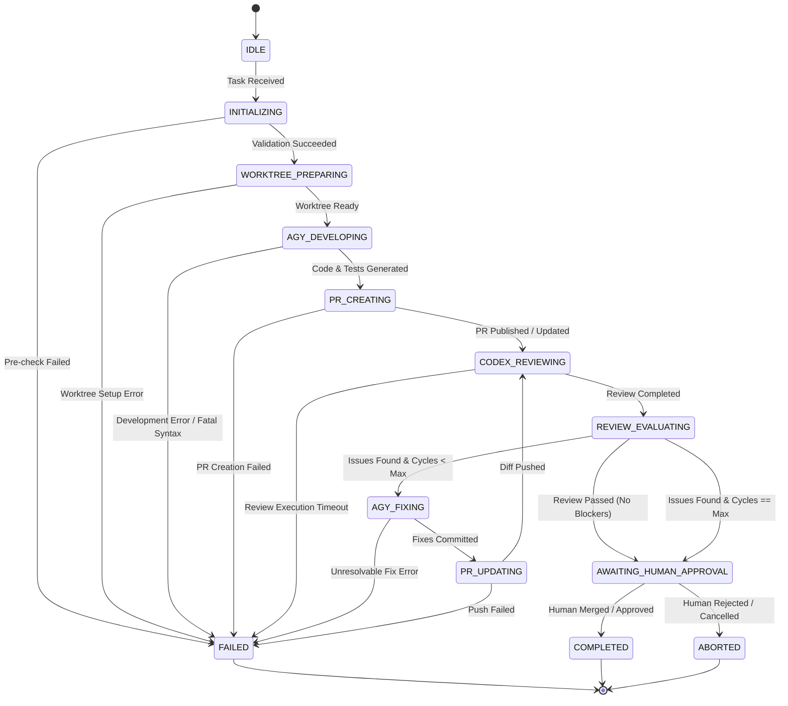

# Orchestrator State Machine & Failure Handling

This document defines the lifecycle states, transition rules, retry strategies, and termination conditions governing task execution in `codex-anti-orchestrator`.

---

## 1. State Machine Overview

The orchestrator operates as a deterministic finite-state machine (FSM). Each task progresses through a structured sequence of development, review, and fix cycles before transitioning to human review.

---

## 2. State Definitions

| State                     | Description                                                                        | Invariants & Requirements                                                    |
| :------------------------ | :--------------------------------------------------------------------------------- | :--------------------------------------------------------------------------- |
| `IDLE`                    | Waiting for incoming task request from Codex App MCP.                              | No active child processes; no temporary worktrees allocated.                 |
| `INITIALIZING`            | Verifying tool readiness (`doctor`), checking target branch, parsing task payload. | Read-only check; fails fast if required tools or credentials are missing.    |
| `WORKTREE_PREPARING`      | Creating isolated git worktree branch `anti/<task-id>`.                            | Dedicated worktree directory created; base branch clean and up-to-date.      |
| `AGY_DEVELOPING`          | Invoking `agy` to generate code, unit tests, and documentation.                    | Sandboxed execution; no `--dangerously-skip-permissions` allowed.            |
| `PR_CREATING`             | Pushing task branch to GitHub remote and opening draft/review PR via `gh`.         | Commit messages adhere to conventional commits; PR contains test summary.    |
| `CODEX_REVIEWING`         | Invoking `codex` in read-only mode against PR diff.                                | Read-only inspection; generates structured review findings.                  |
| `REVIEW_EVALUATING`       | Parsing review findings to determine if action items exist.                        | Evaluates severity; tracks iteration counter `review_cycles`.                |
| `AGY_FIXING`              | Passing review feedback to `agy` to apply corrective changes.                      | Scoped specifically to feedback items; runs test suite to verify fixes.      |
| `PR_UPDATING`             | Pushing corrective commits to remote PR branch.                                    | Incremental commits pushed cleanly to the PR branch.                         |
| `AWAITING_HUMAN_APPROVAL` | PR is ready for human maintainer review, testing, and final merge.                 | Daemon halts autonomous actions and notifies user; no auto-merge.            |
| `COMPLETED`               | Task successfully finished and approved by human maintainer.                       | Temporary worktrees cleaned up and pruned.                                   |
| `FAILED`                  | Unrecoverable error encountered during execution.                                  | Detailed failure diagnostics logged; worktree state preserved for debugging. |
| `ABORTED`                 | Task manually cancelled by operator.                                               | Process halted immediately; clean shutdown.                                  |

---

## 3. Iteration Limits & Loop Prevention

To prevent infinite loops between `CODEX_REVIEWING` and `AGY_FIXING`, strict iteration boundaries are enforced:

- **Maximum Review-Fix Cycles (`MAX_REVIEW_CYCLES`)**: Default: `3`.
- **Behavior on Reaching Limit**:
  - If review issues remain after `MAX_REVIEW_CYCLES` attempts, the state machine **does not fail silently or loop**.
  - It transitions immediately to `AWAITING_HUMAN_APPROVAL` with a prominent warning summary attached to the PR description and logs detailing unresolved feedback.

---

## 4. Retry and Backoff Policy

| Failure Type                              | Max Retries | Backoff Strategy                                          | Action on Exhaustion                                             |
| :---------------------------------------- | :---------- | :-------------------------------------------------------- | :--------------------------------------------------------------- |
| **Network Flake (GitHub API / `gh`)**     | 3           | Exponential: 2s, 4s, 8s with jitter                       | Transition to `FAILED` with network error log.                   |
| **CLI Execution Timeout**                 | 1           | 5s delay before retry                                     | Transition to `FAILED` with timeout diagnostics.                 |
| **Git Lock / Index Contention**           | 2           | Linear: 1s, 2s                                            | Clean lockfiles and transition to `FAILED` if locked.            |
| **Compilation / Lint Failure during Fix** | 2           | Immediate retry with compiler errors injected into prompt | Transition to `AWAITING_HUMAN_APPROVAL` for manual intervention. |

---

## 5. Stop and Termination Conditions

Task execution will immediately stop and enter `FAILED` or `AWAITING_HUMAN_APPROVAL` under any of the following conditions:

1. **Prerequisite Failure**: Any check in `doctor` fails (e.g. `gh auth` lost, missing `codex` or `agy`).
2. **Security Violation Attempt**: Any command attempting to execute forbidden flags (such as `--dangerously-skip-permissions`), modify root files, or push to protected `main` directly.
3. **Merge Conflicts**: Unresolvable Git merge conflicts with base branch during worktree rebase or update.
4. **Credential Expiry**: Any 401/403 authentication error from GitHub or LLM providers.
5. **Operator Abort**: Explicit cancellation signal received via CLI or MCP dispatch.
